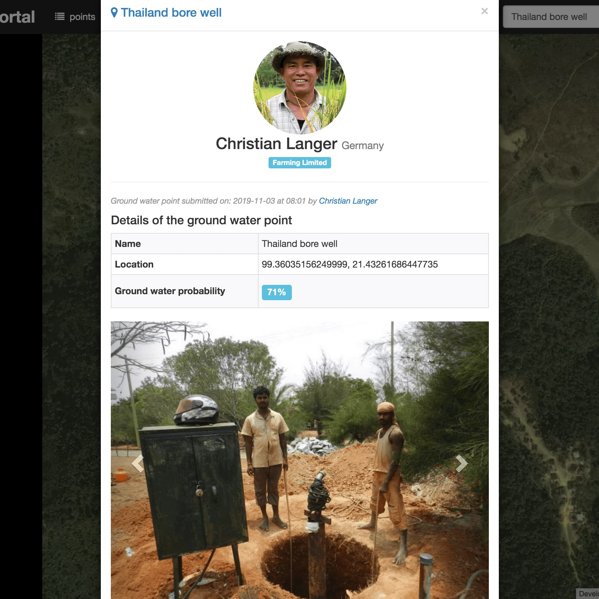

```{r setup, include=FALSE}
knitr::opts_chunk$set(echo = TRUE)
```

<section data-background="img/presentation-examples_2.jpg">

<div>
  <h1>
    <span class="white">Detecting Ground Water Point Bore Wells</span>
  </h1>
</div>

<br>

<div>
  <h3>
    <span class="highlight">GEO Hackathon 2019<br>Challenge 6</span>
  </h3>
</div>

<br>

<div>
  <p>
	<small><span class="white">Ruben Remelgado, Christian Langer, Steffen Ehrmann</span></small>
	</p>
</div>

</section>

## Background

Food production in South East asia is contingent on intensive, water dependen agriculture (rice)

<div class="fragment">
Irrigation, which can be fed by groundwater is required
</div>

<div class="fragment">
Precission farming can help achieve farming goals
</div>

## Goal

web application to inform on potentially locations to install bore holes in Thailand

<div class="fragment">

</div>


